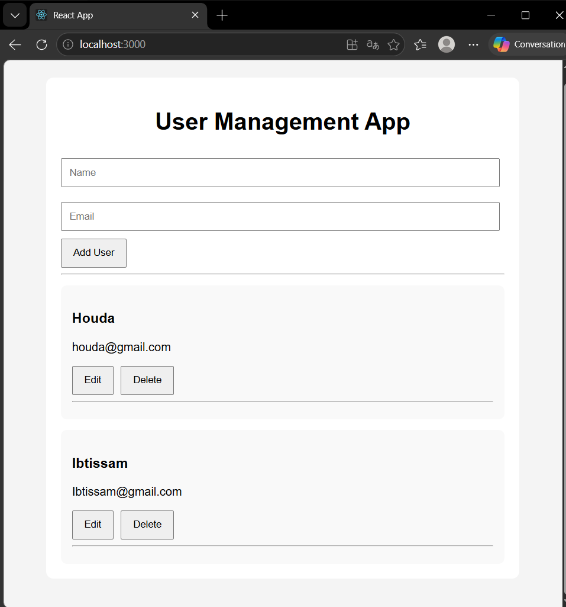

# Application CRUD de Gestion des Utilisateurs

## Description du Projet

Ce projet est une application web CRUD (Create, Read, Update, Delete) simple développée avec :

* **React.js** pour le frontend
* **Express.js** pour le backend

L’application permet de :

* Afficher les utilisateurs
* Ajouter un utilisateur
* Modifier un utilisateur
* Supprimer un utilisateur

Ce projet a été réalisé dans le cadre du module **Technologies Web**.

---

# Technologies Utilisées

## Frontend

### React.js

React.js est utilisé pour développer l’interface utilisateur.

Il permet :

* la création de composants réutilisables
* le rendu dynamique des données
* la gestion de l’état avec les Hooks

---

### useState()

`useState()` est utilisé pour stocker les données dynamiques comme :

* la liste des utilisateurs
* les champs du formulaire
* le mode modification

Exemple :

```js id="j9s8q2"
const [users, setUsers] = useState([]);
```

---

### useEffect()

`useEffect()` permet d’exécuter du code après le rendu du composant.

Dans ce projet, il est utilisé pour :

* récupérer les utilisateurs depuis l’API backend au chargement de la page

Exemple :

```js id="s7d4n1"
useEffect(() => {
   fetchUsers();
}, []);
```

---

### Fetch API

La Fetch API est utilisée pour communiquer avec le backend Express.js.

Elle permet d’effectuer :

* des requêtes GET
* des requêtes POST
* des requêtes PUT
* des requêtes DELETE

---

# Backend

## Express.js

Express.js est utilisé pour créer le serveur backend et l’API REST.

Le backend gère :

* la récupération des utilisateurs
* l’ajout des utilisateurs
* la modification des utilisateurs
* la suppression des utilisateurs

---

## CORS

Le package `cors` est utilisé pour autoriser la communication entre :

* le frontend React.js
* le backend Express.js

---

# Opérations CRUD

| Opération                 | Méthode | Endpoint     |
| ------------------------- | ------- | ------------ |
| Afficher les utilisateurs | GET     | `/users`     |
| Ajouter un utilisateur    | POST    | `/users`     |
| Modifier un utilisateur   | PUT     | `/users/:id` |
| Supprimer un utilisateur  | DELETE  | `/users/:id` |

---

# Structure du Projet

```bash id="u2m6e9"
react-express-user-crud/
│
├── backend/
│   ├── server.js
│   └── package.json
│
├── frontend/
│   ├── src/
│   │   ├── components/
│   │   │   ├── UserForm.js
│   │   │   └── UserList.js
│   │   ├── App.js
│   │   └── App.css
│   └── package.json
│
└── README.md
```

---

# Installation

## Lancer le Backend

```bash id="1r8d5w"
cd backend
npm install
npm start
```

Le serveur backend fonctionne sur :

```bash id="m4q9v7"
http://localhost:5000
```

---

## Lancer le Frontend

```bash id="c7y1t6"
cd frontend
npm install
npm start
```

Le frontend fonctionne sur :

```bash id="n5k3x8"
http://localhost:3000
```

---

# Capture d’Écran de l’Application

## Interface Fonctionnelle



---

# Fonctionnalités

* Ajouter un utilisateur
* Afficher la liste des utilisateurs
* Modifier un utilisateur
* Supprimer un utilisateur
* Mise à jour dynamique avec React Hooks
* Communication entre frontend et backend

---

# Ce que J’ai Appris

Grâce à ce projet, j’ai appris :

* les bases de React.js
* les composants React
* les Hooks React (`useState`, `useEffect`)
* les appels API avec Fetch
* le développement backend avec Express.js
* les opérations CRUD
* l’intégration frontend/backend
* l’utilisation de Git et GitHub

---

# Auteur

Houda Eljirari
